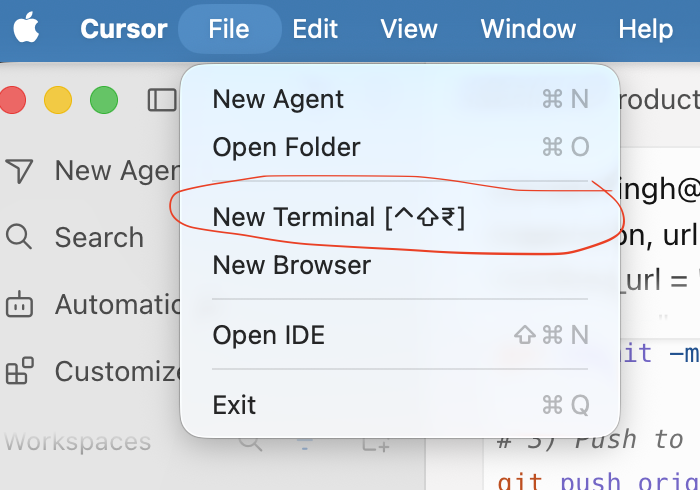

# Direct Install From GitHub

Install SpecKit for Salesforce directly from the GitHub-hosted release zip — no `git clone`, no wizard prompts. This is the same manifest-driven pattern used by the SF Audit Tool.

Current published version:

- `1.0.0`

Current download URL:

- `https://github.com/pravsingh1987/speckit-salesforce/raw/refs/heads/main/speckit-salesforce-v1.0.0.zip`

## Prerequisites

Make sure these are available in your terminal:

- `python3`
- `bash`

Check:

```bash
python3 --version
bash --version
```

## Where to run these commands

Run the commands in a **real terminal**, not inside an AI agent's chat sandbox:

- **Cursor** — open one via the menu: **File → New Terminal** (shortcut shown next to the menu item).
- **Claude / Claude Code** — use its built-in terminal.
- Or the plain **macOS Terminal** app.



Open the terminal **inside the project folder** you want SpecKit added to (or `cd` into it first).

## One-Shot Install

Run this **from inside the project folder** you want SpecKit added to. It reads `latest-release.json`, downloads the latest published zip, extracts it, and installs SpecKit into the current project non-interactively:

```bash
python3 - <<'PY'
import json, urllib.request, os, zipfile, subprocess
manifest_url = "https://github.com/pravsingh1987/speckit-salesforce/raw/refs/heads/main/latest-release.json"
manifest = json.load(urllib.request.urlopen(manifest_url))
zip_url = manifest["download_url"]
zip_name = zip_url.split("/")[-1]
folder = zip_name[:-4]
urllib.request.urlretrieve(zip_url, zip_name)
with zipfile.ZipFile(zip_name) as zf:
    zf.extractall(".")
subprocess.check_call(["bash", os.path.join(folder, "install.sh"), ".", "--yes"])
print("SpecKit installed into the current project.")
PY
```

The `--yes` flag runs `install.sh` in **non-interactive** mode: it accepts sensible defaults for every prompt (project name = folder name, industry = General, integrations skipped) so nothing needs to be typed. Customize later in `.specify/memory/`.

After it finishes:

1. **Reload Cursor** (Cmd+Shift+P → "Reload Window") so it picks up the new skills.
2. All `/speckit-*` commands now work in this project.
3. Verify what landed:

```bash
ls .cursor/skills   # 14 speckit-* commands
ls .cursor/rules    # grounding-guardrails.mdc, wireframe-salesforce-anatomy.mdc, dashboard-enforcement.md
```

## Step-by-Step Alternative

### 1. Download the latest zip

```bash
curl -L -o speckit-salesforce-v1.0.0.zip "https://github.com/pravsingh1987/speckit-salesforce/raw/refs/heads/main/speckit-salesforce-v1.0.0.zip"
```

### 2. Extract the zip

```bash
unzip speckit-salesforce-v1.0.0.zip
```

### 3. Install into your current project

```bash
bash speckit-salesforce-v1.0.0/install.sh . --yes
```

Drop `--yes` if you want the full interactive 5-step configuration wizard instead.

## Generic Commands For Any Future Version

Replace `X.Y.Z` with the published release version.

```bash
curl -L -o speckit-salesforce-vX.Y.Z.zip "https://github.com/pravsingh1987/speckit-salesforce/raw/refs/heads/main/speckit-salesforce-vX.Y.Z.zip"
unzip -q speckit-salesforce-vX.Y.Z.zip
bash speckit-salesforce-vX.Y.Z/install.sh . --yes
```

## Publishing / Cutting a New Release (maintainers)

The one-shot installer depends on two artefacts committed at the repo root:

- `latest-release.json` — the manifest (`latest_version`, `download_url`, `notes_url`).
- `speckit-salesforce-v<version>.zip` — the release zip, containing a top-level `speckit-salesforce-v<version>/` folder with `install.sh`, `.specify/`, `.cursor/`, `docs/`, etc.

To cut a new release:

1. Bump `version` in `pyproject.toml` and `latest_version` + `download_url` in `latest-release.json`.
2. Build the zip:

   ```bash
   python3 build-release.py
   ```

3. Commit the regenerated zip and manifest, then push:

   ```bash
   git add latest-release.json speckit-salesforce-v*.zip build-release.py install.sh
   git commit -m "release: speckit-salesforce vX.Y.Z"
   git push origin main
   ```

`build-release.py` reads the version from `pyproject.toml` and packages the correct file set automatically.

## Troubleshooting

### `command not found: python3`

Install Python 3 (macOS: `brew install python`), or use the `git clone` install method in `INSTALLATION_GUIDE.md`.

### Skills don't appear in Cursor

Reload the Cursor window after install, and confirm `.cursor/skills/` exists in the project root.

### Download fails / manifest unreachable

Usually a network/proxy restriction blocking GitHub. Try the step-by-step `curl` alternative above, or download the zip in a browser and run `install.sh` from it.
